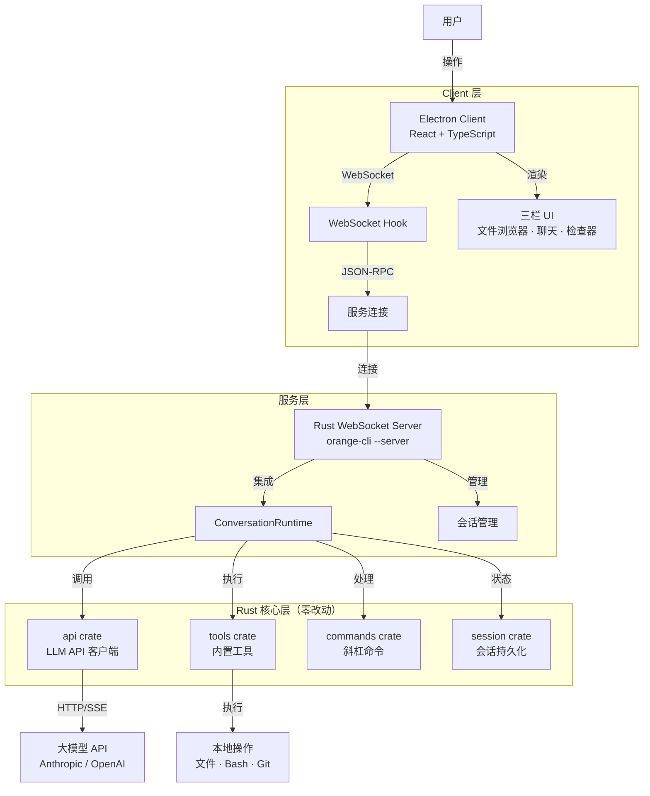
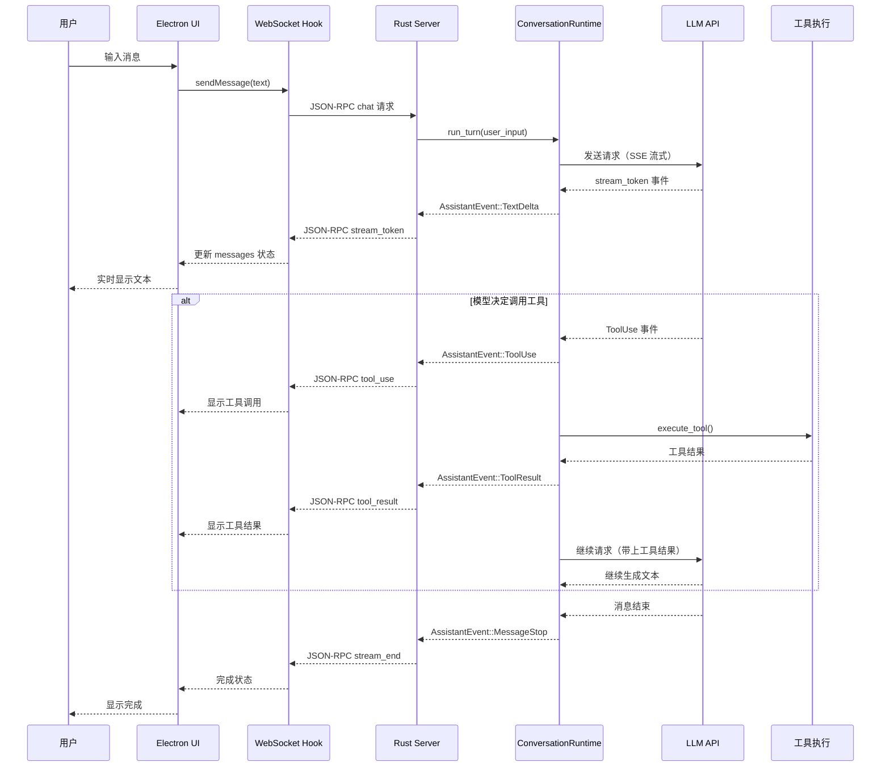

# Orange Code 架构与二次开发指南 (ARCHITECTURE)

## 1. 架构概览

Orange Code 是一个本地 AI 编程助手，旨在提供交互式会话、智能工具调用和工作区上下文感知能力。项目经历了从早期 Python 架构原型到当前高性能 Rust 核心的演进。

目前代码库分为三个主要部分：
- **`rust/` 目录**：当前的**核心生产环境**。基于安全 Rust 实现，提供 CLI、API 客户端、运行时调度、工具调用及 MCP（Model Context Protocol）支持。
- **`client/` 目录**：**Electron 桌面客户端**。基于 React + TypeScript + Vite 的现代化跨平台桌面界面。
- **`src/` 目录**：早期的 **Python 架构原型与审计脚手架**。主要用于对齐原始设计、提供架构参考和通过 `parity_audit` 衡量迁移进度。它通过解析 `reference_data/` 中的 JSON 快照来模拟意图路由和会话，并不包含真实的破坏性业务逻辑。

---

## 1.1 Orange Code Desktop 产品架构

### 整体架构图



### 产品设计流程图



---

## 2. Rust 核心架构与数据流

Rust 工作区（Workspace）采用清晰的分层架构，依赖关系从底层向应用层单向流动：

### 2.1 依赖分层
1. **基础层 (Foundation Layer)**
   - `plugins`: 动态扩展机制，管理外部插件的生命周期和 Hook（如 `PreToolUse`）。
   - `lsp`: 语言服务器协议支持（封装 rust-analyzer、pyright 等），提供代码级上下文理解。
2. **核心层 (Core Layer)**
   - `runtime`: 系统的“大脑”。整合 `plugins` 和 `lsp`，负责会话状态管理（`session.rs`）、对话主循环（`conversation.rs`）、上下文 Token 压缩（`compact.rs`）、安全权限拦截以及 MCP 挂载。
3. **业务与功能层 (Business Logic Layer)**
   - `api`: 依赖 `runtime`。负责与 LLM（如 Anthropic, OpenAI 兼容源）的 HTTP/SSE 通信与数据模型序列化。
   - `commands`: 依赖 `runtime` 和 `plugins`。实现 CLI 斜杠指令（如 `/help`, `/compact`, `/commit`）的路由与业务逻辑。
   - `server`: 依赖 `runtime`。提供基于 `axum` 的 HTTP/SSE 后台服务，供外部 IDE 插件等调用。
4. **高级工具层 (Tools Layer)**
   - `tools`: 依赖 `api`, `plugins`, `runtime`。管理所有内置工具（Built-in Tools，如 bash、文件读写、grep 搜索、Web fetch 等）的注册与参数校验。
   - `compat-harness`: 兼容层，用于处理历史配置的过渡。
5. **应用层 (Application Layer)**
   - `orange-cli`: 终端应用入口。组合底层所有 crate，提供 REPL 交互、Markdown 富文本渲染以及命令行参数解析。

### 2.2 核心数据流 (Data Flow)
1. **用户输入**：通过 `orange-cli` 的 REPL 接收 Prompt。
2. **意图拦截**：若为 `/` 开头，路由至 `commands` 直接本地处理；否则进入 `runtime` 对话循环。
3. **上下文组装**：`runtime` 提取历史 Session，结合 `lsp` 提供的语法树信息和 `config` 环境变量，组装请求。
4. **模型交互**：`api` 层将请求发送至大模型，通过 SSE 接收流式响应。
5. **工具调度**：若模型决定调用工具，触发 `runtime` 权限校验，校验通过后由 `tools` 执行（如执行 bash 或读写文件），并将结果反馈给模型，继续生成直至结束。

---

## 3. Python 架构原型角色

`src/` 目录作为历史架构的快照和审计工具，包含以下核心：
- `PortRuntime` (`runtime.py`): 顶层调度器，包含基于字符串的简单意图路由。
- `QueryEnginePort` (`query_engine.py`): 负责 Token 消耗监控和对话轮次控制。
- `ExecutionRegistry` (`execution_registry.py`): 工具和命令的存根注册中心。
- `ParityAuditResult` (`parity_audit.py`): 对比新旧架构，生成迁移覆盖率报告。

**注意**：在进行以业务落地为目标的二次开发时，**主要精力应集中在 `rust/` 目录**。Python 目录主要用于查阅原始架构逻辑或进行轻量级的路由策略实验。

---

## 4. 二次开发指南 (扩展点)

Orange Code 的高度模块化设计使其非常容易扩展。以下是常见的二次开发场景及操作路径：

### 4.1 接入新的大模型提供商 (Provider)
**目标文件**：`rust/crates/api/src/providers/`
1. 在 `providers/` 下新建模块（如 `deepseek.rs` 或 `gemini.rs`）。
2. 实现提供商特有的请求构造器和 SSE 流式事件解析器。
3. 在 `api/src/client.rs` 中注册新 Provider 的路由逻辑。

### 4.2 添加新的内置工具 (Built-in Tool)
**目标文件**：`rust/crates/tools/src/lib.rs` 及具体实现文件
1. 确定工具能力（如 `git_diff_tool` 或 `browser_search`）。
2. 在 `tools/src/lib.rs` 的 `mvp_tool_specs()` 中注册工具的 JSON Schema（Input 参数定义）。
3. 在 `runtime` 中（如 `runtime/src/file_ops.rs` 或新建模块）实现底层的实际业务逻辑。
4. 在 `runtime/src/conversation.rs` 的工具调度 `match` 分支中将工具名映射到实际执行函数。

### 4.3 添加新的斜杠命令 (Slash Command)
**目标文件**：`rust/crates/commands/src/lib.rs`
1. 在 `SlashCommand` 枚举中增加新命令（如 `Deploy`）。
2. 实现命令的解析逻辑（提取参数）。
3. 在命令处理器中编写对应的环境调度或业务逻辑。

### 4.4 完善 Hook 与插件机制
**目标文件**：`rust/crates/plugins/` 与 `rust/crates/runtime/src/conversation.rs`
- **背景**：根据 `PARITY.md`，当前 Rust 版本已解析了 Hook 配置，但在运行时（`conversation.rs`）并未实际触发 `PreToolUse` 或 `PostToolUse` 钩子逻辑。
- **行动**：在工具调用的执行前后，显式插入调用 `plugins` 模块中 Hook 执行链的代码，允许外部脚本拦截、修改参数或阻断工具执行。

### 4.5 定制化 CLI 与终端 UI
**目标文件**：`rust/crates/orange-cli/src/render.rs` 和 `main.rs`
1. 修改 `render.rs` 中的 ANSI 控制码和 Markdown 渲染逻辑，以调整高亮颜色、加载动画（Spinner）或布局。
2. 优化静默/批处理模式（Headless），以更好地集成到 CI/CD 流水线中。

---

## 5. Orange Code Desktop 架构

### 5.1 设计原则

| 原则 | 说明 |
|------|------|
| **Rust 核心零改动 | runtime、api、tools、commands 等 crate 完全保持原样，不做任何功能修改 |
| **服务层轻量集成 | 仅在 orange-cli/src/server.rs 中集成 ConversationRuntime |
| **Client 独立演进 | Electron 客户端独立开发，通过 WebSocket 与后端通信 |

### 5.2 三层架构详解

#### Layer 1: Rust 核心层（保持不变）

```
rust/crates/
├── runtime/     ← 对话主循环、会话管理、工具调度
├── api/       ← LLM API 客户端
├── tools/     ← 内置工具管理
├── commands/  ← 斜杠命令
└── orange-cli/← CLI 入口 + server.rs（需完善）
```

#### Layer 2: 服务层（完善 server.rs）

**职责**：
- 集成 `ConversationRuntime`（参考 `LiveCli` 的实现方式）
- WebSocket + JSON-RPC 2.0 接口
- 会话管理、流式输出、工具调用事件

**协议**：
```json
// Client → Server
{
  "jsonrpc": "2.0",
  "method": "chat",
  "params": { "message": "..." },
  "id": 123
}

// Server → Client (事件
{ "jsonrpc": "2.0", "method": "stream_start", "id": 123 }
{ "jsonrpc": "2.0", "method": "stream_token", "params": { "token": "..." }, "id": 123 }
{ "jsonrpc": "2.0", "method": "tool_use", "params": { "id": "...", "name": "...", "input": "..." }, "id": 123 }
{ "jsonrpc": "2.0", "method": "tool_result", "params": { "id": "...", "result": "..." }, "id": 123 }
{ "jsonrpc": "2.0", "method": "usage", "params": { "input_tokens": 123, "output_tokens": 456 }, "id": 123 }
{ "jsonrpc": "2.0", "method": "stream_end", "id": 123 }
```

#### Layer 3: Electron Client 层

**技术栈**：
- React 19 + TypeScript
- Vite
- Tailwind CSS 4.x
- framer-motion（动画）
- lucide-react（图标）

**目录结构**：
```
client/
├── electron/
│   ├── main.ts      ← 主进程：启动 Rust 子进程
│   └── preload.ts   ← 预加载脚本
├── src/
│   ├── App.tsx       ← 主应用组件（三栏布局）
│   ├── main.tsx      ← 入口
│   ├── hooks/
│   │   └── useOrangeWebSocket.ts  ← WebSocket Hook
│   └── components/  ← UI 组件
└── package.json
```

**三栏 UI**：
- **左侧栏**：文件浏览器（260px，可折叠）
- **中间栏**：聊天界面（消息展示、输入、流式输出）
- **右侧栏**：检查器（320px，可折叠）- Token 统计、工具调用状态、后端状态

### 5.3 通讯流程

1. **启动流程**：
   ```
   Electron 主进程启动
       ↓
   启动 Rust 子进程：orange --server --port 34567
       ↓
   React 前端加载
       ↓
   WebSocket 连接：ws://127.0.0.1:34567/ws
   ```

2. **消息流程**：
   ```
   用户输入 → WebSocket → JSON-RPC → ConversationRuntime
       ↓
   LLM API（SSE 流式）
       ↓
   AssistantEvent 转换
       ↓
   JSON-RPC 事件 → WebSocket → React UI 更新
   ```

### 5.4 开发优先级

| 阶段 | 任务 |
|------|------|
| **Phase 1** | 完善 server.rs，集成 ConversationRuntime |
| **Phase 2** | 完善 Client 聊天界面，支持基本对话 |
| **Phase 3** | 添加工具调用可视化 |
| **Phase 4** | 会话管理（保存/恢复） |
| **Phase 5** | 完善文件浏览器和检查器 |