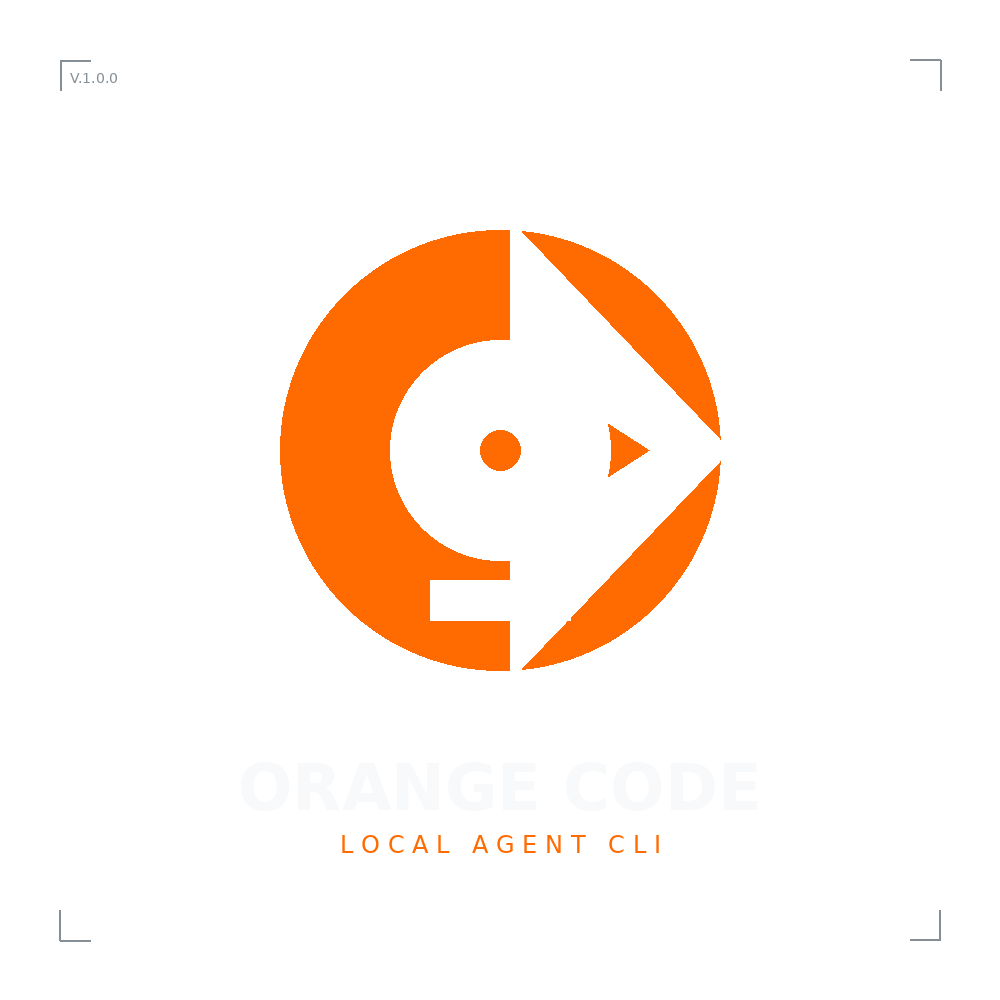

# Orange Code Desktop

<p align="center">
  
</p>

<p align="center">
  <strong>基于 Rust 和 React 的本地 AI 代码助手跨平台桌面客户端</strong>
</p>

> [!IMPORTANT]
> **当前版本:** v0.0.5
> 
> **项目说明:** 本项目基于开源项目 [Orange Code](https://github.com/instructkr/orange-code) 的底层 Rust 架构进行二次开发，为其构建了一个现代化的、跨平台的桌面客户端（基于 Electron + React）。本项目现作为个人效率工具 **Orange Code Desktop** 独立维护，专注于提供安全、高效的本地 AI 编程辅助体验。

---

## 🌟 核心特性

Orange Code Desktop 结合了 Rust 的极速性能与 Web 技术的灵活展现，为您提供最顺畅的本地代理（Agent）编程体验：

- 🚀 **极速响应**: 后端采用安全且高性能的 Rust 编写，资源占用极低。
- 💻 **跨平台桌面端**: 基于 Electron 构建，完美支持 Windows、macOS 和 Linux。
- ⚡ **流式输出**: 通过 WebSocket 实现 JSON-RPC 双向通信，AI 回答毫秒级逐字显示。
- 🛡️ **沙箱安全**: 严格的 Electron 上下文隔离（Context Isolation）与沙箱（Sandbox）机制，安全执行代码操作。
- 🎨 **现代化 UI**: 采用 React + Vite 构建的丝滑用户界面。

---

## 🏗️ 架构概览

系统采用典型的本地 C/S (Client/Server) 架构：

- **前端 (React + Vite)**：运行在 Electron 的渲染进程沙箱中。负责 GUI 呈现、用户输入、会话管理和流式消息的展示。
- **主进程 (Electron Node.js)**：负责窗口管理、系统级 API 调用、安全沙箱配置，以及**启动并管理 Rust 子进程的生命周期**。
- **后端 (Rust)**：在现有的 `orange` CLI 基础上增加了 `--server` 模式。启动后监听本地固定端口，接收 WebSocket 连接，解析 JSON-RPC 请求并执行核心的 AI 逻辑。

---

## 📂 目录结构

```text
orange-code/
├── client/                             # Electron + Vite + React 桌面端源码
│   ├── electron/                       # Electron 主进程代码 (进程管理/沙箱配置)
│   ├── src/                            # React 前端界面代码 (Hooks/组件)
│   ├── package.json                    # 前端依赖与打包配置
│   └── vite.config.ts                  # Vite 构建配置
├── rust/                               # Rust 核心后端 (原 CLI 服务)
│   ├── crates/api-client/              # API 客户端与流式处理
│   ├── crates/runtime/                 # 核心运行时 (上下文、MCP 编排)
│   ├── crates/orange-cli/              # 包含 server 模式的入口
│   └── ...
├── build_scripts/                      # 自动化打包脚本
├── assets/                             # 静态资源与 Logo 文件
└── README.md                           # 项目说明文档
```

---

## 🛠️ 快速开始

### 开发环境调试

1. **环境准备**：确保您已安装 [Node.js](https://nodejs.org/) (v20+) 和 [Rust 工具链](https://rustup.rs/)。
2. **构建 Rust 后端**：
   ```bash
   cd rust
   cargo build --release
   cd ..
   ```
3. **启动客户端开发模式**：
   ```bash
   cd client
   npm install
   npm run dev
   ```
   > 这将自动启动 Vite 服务并拉起 Electron 窗口，同时会在后台自动启动 Rust WebSocket 服务器。

### 打包发布版

如果您想在本地构建可执行文件（`.exe`, `.dmg`, `.AppImage`）：

```bash
./build_scripts/build_all.sh
```
构建产物将输出在 `client/release/` 目录下。

---

## 🤖 自动化 CI/CD

本项目已配置了完整的 GitHub Actions 工作流。当您向仓库推送以 `v` 开头的 Tag（例如 `v1.0.0`）时，会自动触发跨平台（Ubuntu、Windows、macOS）的构建流水线，并将打包好的安装包自动发布至 GitHub Releases 页面。

---

## 📜 免责声明

- 本项目的 Rust 底层架构衍生自 [Orange Code](https://github.com/instructkr/orange-code)。
- 本桌面端重构项目纯粹出于技术研究、个人学习与工具定制目的而创建和维护。
- 本项目不隶属于原作者团队，也不声称对原始底层架构代码的完全所有权。